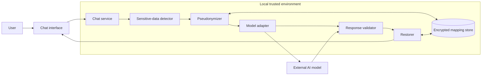

# Privacy-Preserving AI Chat

Concept and architecture for a local privacy gateway that pseudonymizes sensitive information before sending prompts to external AI models and restores protected values locally.

> **Project status:** concept and architecture design. This repository does not currently provide a production-ready, security-certified or executable implementation.

## The problem

AI assistants are useful for writing, analysis and document processing, but user prompts may contain names, identification numbers, email addresses, phone numbers, account references or other sensitive information.

Sending those values directly to an external model provider can create privacy, governance and compliance risks. This project explores a design in which sensitive values are transformed locally before a prompt leaves the trusted environment.

## Proposed approach

```text
Original user message
        |
        v
Sensitive-data detection
        |
        v
Local pseudonymization
        |
        v
Protected prompt sent to the model
        |
        v
Protected model response
        |
        v
Token validation and local restoration
        |
        v
Final response shown to the user
```

The mapping between placeholders and original values remains inside the local trust boundary and is never included in the prompt sent to the model.

## Example

**Original message**

```text
Draft an email for Laura Perez, identified with document 12345678.
```

**Prompt sent to the external model**

```text
Draft an email for [[PERSON_A7F2]], identified with document [[DOCUMENT_81C4]].
```

**Protected model response**

```text
Dear [[PERSON_A7F2]], ...
```

**Locally restored response**

```text
Dear Laura Perez, ...
```

This is reversible pseudonymization, not irreversible anonymization.

## Design principles

- Sensitive information is processed locally before any external model call.
- The placeholder mapping is never sent to the model provider.
- Detection failures should follow a fail-closed policy.
- Restoration accepts only known, exact placeholders.
- Unknown or altered placeholders trigger review instead of partial restoration.
- Secrets, raw prompts and mappings must not appear in application logs.
- The first MVP is intentionally text-only.
- Public examples use synthetic information only.

## Conceptual components

| Component | Responsibility |
| --- | --- |
| Chat interface | Receives the user request and displays the final response. |
| Chat service | Coordinates privacy processing, model invocation and restoration. |
| Sensitive-data detector | Identifies configured categories of sensitive information. |
| Pseudonymizer | Replaces detected values with scoped, unpredictable placeholders. |
| Mapping store | Keeps reversible mappings inside the trusted local environment. |
| Model adapter | Sends only protected content to the selected external model. |
| Response validator | Rejects unknown, missing or malformed placeholders. |
| Restorer | Replaces validated placeholders with their original local values. |

## Conceptual architecture



## Initial MVP scope

The first implementation is planned as a local Python application with:

- A simple chat interface.
- Rule-based detection for structured values such as email addresses, phone numbers and document identifiers.
- Reversible pseudonymization with conversation-scoped placeholders.
- A single model-provider adapter.
- Exact placeholder validation and restoration.
- Synthetic test cases proving that original values do not reach the model adapter.
- Local storage with encryption added before real sensitive information is used.

Authentication, multimodal processing, organizational deployment and advanced entity recognition belong to later phases.

## Repository structure

```text
privacy-preserving-ai-chat/
├── README.md
├── LICENSE
├── .gitignore
├── assets/
│   └── diagrams/
├── docs/
│   ├── problem.md
│   ├── proposed-solution.md
│   ├── architecture.md
│   ├── privacy-flow.md
│   ├── threat-model.md
│   ├── technical-decisions.md
│   ├── limitations.md
│   └── roadmap.md
└── examples/
    └── synthetic-pseudonymization-example.md
```

## Documentation

- [Problem](docs/problem.md)
- [Proposed solution](docs/proposed-solution.md)
- [Architecture](docs/architecture.md)
- [Privacy flow](docs/privacy-flow.md)
- [Threat model](docs/threat-model.md)
- [Technical decisions](docs/technical-decisions.md)
- [Limitations](docs/limitations.md)
- [Roadmap](docs/roadmap.md)
- [Synthetic example](examples/synthetic-pseudonymization-example.md)

## What this repository demonstrates

This concept project is intended to demonstrate:

- Privacy-by-design thinking for generative AI systems.
- Clear separation between trusted local processing and external model providers.
- Threat modeling and fail-closed design.
- Product scoping from concept to an achievable MVP.
- Technical communication through architecture and design documentation.

## Important limitation

Pseudonymization reduces exposure but does not automatically make a system secure or compliant. Real protection depends on detector quality, encryption, key management, access control, retention policies, logging discipline, provider contracts and independent security evaluation.

Do not use this concept with real sensitive information until an implementation has been built, tested and reviewed.

## License

MIT License.
