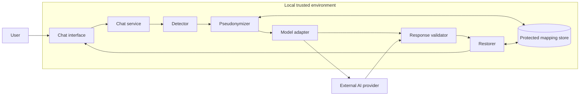
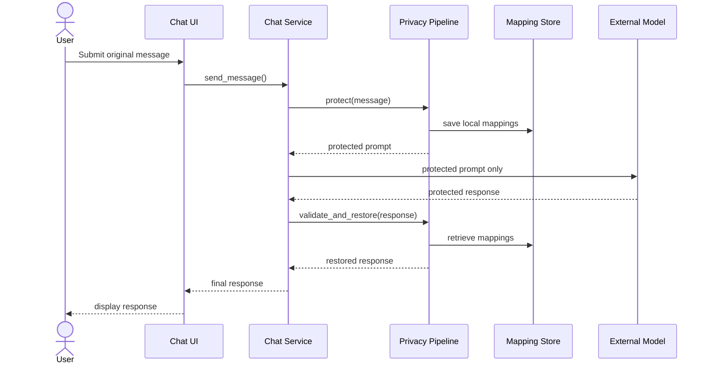

# Architecture

## Main components

### Chat interface

Collects user input and displays only the final restored response. The interface should not call a model provider directly.

### Chat service

Coordinates the complete workflow and ensures that every outbound message passes through the privacy pipeline.

### Sensitive-data detector

Identifies configured sensitive entities. The initial MVP can use deterministic rules for structured values and later add specialized entity-recognition components.

### Pseudonymizer

Replaces detected values with placeholders that are scoped to a conversation or request.

Example:

```text
Laura Perez -> [[PERSON_A7F2]]
12345678 -> [[DOCUMENT_81C4]]
```

### Mapping store

Stores the relationship between placeholders and original values. This store is one of the most sensitive assets in the system and must remain inside the local trust boundary.

### Model adapter

Provides the only permitted route to an external model provider. It receives protected content, not the original prompt.

### Response validator

Checks that returned placeholders are known, exact and structurally valid before restoration.

### Restorer

Replaces validated placeholders with their original values and returns the final response to the chat service.

## Trust boundaries



The boundary between the model adapter and the provider is the key privacy boundary. Original sensitive values must not cross it.

## Conceptual sequence



## Future deployment evolution

The first MVP can remain a local monolith. A later organizational version could separate the interface, privacy service, identity layer, model gateway, encrypted storage and audit infrastructure, but that complexity is intentionally deferred.
